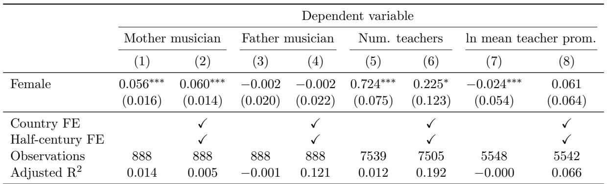

Table 6: Gender differences in composers’ family background and teacher access

Notes: Standard errors are clustered at the country level. Significance levels: $^ { * * * } p < 0 . 0 1 ; ^ { * * } p < 0 . 0 5 ; ^ { * } p < 0 . 1$ .

musician-father. The coefficient estimates indicate that while male and female composers were equally likely to have musician-fathers, female composers were a statistically significant 6 percentage points more likely to have musician-mothers than male composers. Given that only 3 percent of male composers had composer-mother, female composers were three times more likely to have a musician-mother than male composers. Musician-mothers may therefore have been especially important in nurturing female musical talent.

We next turn to the consequences of musician-parents for composer prominence. To do this, we estimate the following regression:

$$
l n (w o r d c o u n t) _ {i} = \beta_ {0} + \beta_ {1} (f e m a l e _ {i}) + \beta_ {2} (m o t h e r m u s i c i a n) +
$$

$$
\beta_ {3} (f a t h e r m u s i c i a n _ {i}) + \beta_ {4} (f e m a l e _ {i}) \times (m o t h e r m u s i c i a n _ {i}) + \tag {3}
$$

$$
\beta_ {5} (f e m a l e _ {i}) \times (f a t h e r m u s i c i a n _ {i}) + \gamma_ {i} + \delta_ {t} + \epsilon_ {i}
$$

The outcome variable in this equation is the natural logarithm of the word count of composer $i ^ { \prime } s$ main description; $f e m a l e _ { i }$ is a binary indicator equal to one if composer i is female; mother musiciani and f ather musiciani are binary indicators equal to one if composer i has a musician-mother or musician-father, and the remaining variables are defined as before. If musician-parents are beneficial for a composer’s future prominence, $\beta _ { 2 }$ or $\beta _ { 3 }$ should be positive